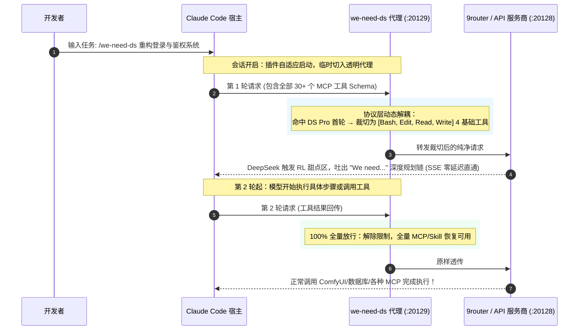

# we-need-ds 🎯

> **首个专为 Claude Code / cc-haha 打造的 DeepSeek Pro 满血 "We need" 深度思维链原生增强插件**

<p align="center">
  
  
  
  
</p>

---

## 🧐 背景：为什么你的 DeepSeek 总是“不聪明”？

近期开源社区（参考 DeepSeek Harness 社区的深入研究）发现了一个极其关键的模型机制：**DeepSeek-V4-Pro 系列模型在不同工具上下文下的推理能力存在显著的“双面性”**：

| 模式 | 表现特征 | 核心原因 |
| :--- | :--- | :--- |
| 🟢 **"We need..." 满血深度规划** | 面对复杂工程任务，首先自发进行宏观全局拆解、边界推演、架构设计，展现极高水准的 AGI 战略规划能力。 | 模型首轮仅看到基础必要工具，触发 RL（强化学习）训练中的**深度推理甜点区**。 |
| 🔴 **"Let me..." 浅层工具试探** | 陷入微观琐碎的工具调用纠结，输出频繁试错、不断摸索，思维链退化为机械式的工具调用循环（Tool-Churning）。 | 客户端首轮注入数十个 MCP 工具、技能扩展、复杂 Schema，模型的注意力机制被过度牵引。 |

### 行业现状与空白
* **DSH 社区验证了原理，但 Claude Code 生态依然缺席**：现有的解决方案大多停留在 Python 脚本或专有 CLI 框架中。
* **Claude Code 生态的巨大矛盾**：现代开发者在 Claude Code 中普遍挂载了大量 MCP 工具（数据库、浏览器、绘图、终端等）。如果为了诱导 "We need" 而手动把 MCP 全关掉，开发体验直接报废；如果不关，DeepSeek 就会永远陷在 "Let me" 的泥潭里。
* **提示词（Prompt 催眠）治标不治本**：无论在 System Prompt 里如何强调“请使用 We need 思考”，只要底层的 JSON 请求体里依然带有一长串复杂的 Tool Schemas，模型就会被注意力机制强制牵引回工具试探中。

---

## 💡 我们的解决方案：双阶段动态解耦（Two-Phase Bootstrap）

**`we-need-ds`** 是专为 Claude Code / cc-haha 原生设计的全自动增强插件，**无需关闭任何 MCP，零感知唤醒满血 DeepSeek**：



### 核心亮点
1. 🚀 **全自动懒人模式**：会话启动/指令触发时自动拉起后台守护代理并切换端点；会话结束或空闲 30 分钟自动还原端点并退出，不常驻占用内存。
2. 🛡️ **MCP 零损耗**：仅在首轮“骗”模型建立全局思维链，第二轮起所有 MCP、Skills 全量释放。
3. 🎯 **精准模型过滤（超强鲁棒性）**：内置正则归一化引擎，仅精准拦截 `deepseek-v4-pro*`（无论下划线、空格、连字符还是路径前缀），Claude、Gemini、GPT、Kimi 等其他模型 **100% 纯净透传，零干预**。
4. 🌐 **双模自适应**：原生适配 cc-haha（自动管理 `providers.json`）与纯正 Claude Code 官方环境（支持环境变量）。

---

## 🛠️ 安装与使用

### 1. 插件安装
在 Claude Code 中通过官方市场一键安装：
```bash
/plugin install we-need-ds@claude-plugins-official
```

### 2. 日常使用命令全景

插件提供了丰富、直观的斜杠命令矩阵：

| 斜杠命令 | 功能说明 | 典型使用场景 |
| :--- | :--- | :--- |
| **`/we-need-ds:run <任务>`** | **一键启动满血思维链并执行** | 日常最常用入口，直接附带任务，自动拉起拦截并完成任务 |
| **`/we-need-ds:plan <任务>`** | **调用只读规划专家子代理** | 超大项目、重构任务，想先看 Markdown 规划而不动代码 |
| **`/we-need-ds:doctor`** | **一键深度体检** | 排查端口占用、9router 连通性、环境模式、激活 Provider 状态 |
| **`/we-need-ds:test`** | **运行两阶段解耦自测试套件** | 9 组模型归一化与工具裁切/放行断言，直观查看拦截效果 |
| **`/we-need-ds:status`** | **查看当前运行与拦截状态** | 查看当前代理是否在跑、拦截开关、原始 URL 与日志文件 |
| **`/we-need-ds:on`** | **手动强制开启拦截** | 手动将当前 Provider baseUrl 切换到代理端口 |
| **`/we-need-ds:off`** | **手动关闭拦截并还原** | 随时手动恢复原始 baseUrl 端点 |

---

## ⚙️ 配置文件说明 (`config.json`)

配置文件位于插件根目录，开箱即用：

```json
{
  "port": 20129,
  "targetBaseUrl": "auto",
  "targetModels": [
    "deepseek-v4-pro-0813",
    "deepseek-v4-pro"
  ],
  "bootstrapCoreTools": [
    "Bash",
    "Edit",
    "Read",
    "Write"
  ],
  "logDetails": false,
  "idleAutoShutdownMinutes": 30
}
```

* `targetBaseUrl`：默认为 `"auto"`，自动读取当前激活 Provider 的原始上游 URL（跳过 20129 自身防回环）；也可手动配置为任意中转商/9router 地址。
* `targetModels`：需要触发拦截的模型列表（支持模糊匹配）。
* `bootstrapCoreTools`：首轮保留的核心诱导工具集（默认 `Bash, Edit, Read, Write`）。
* `idleAutoShutdownMinutes`：无请求空闲退出时间（默认 30 分钟，退出前会自动还原配置）。

---

## 🔒 安全与隐私

* **纯本地监听**：代理仅绑定 `127.0.0.1:20129`，绝不对外暴露端口。
* **零延迟直通**：SSE 流式响应采用 Node.js 原生 Stream `pipe()` 直通转发，无任何二次封装延迟。
* **安全可回退**：修改均带状态记录（`runtime-state.json`），任何时候敲 `/we-need-ds:off` 或关掉终端都会自动还原。

---

## 📄 开源许可证

本项目基于 [MIT License](LICENSE) 开源。欢迎提交 PR 与 Issue！

**作者**: [YixuAn](https://github.com/YixuAnsensei)
