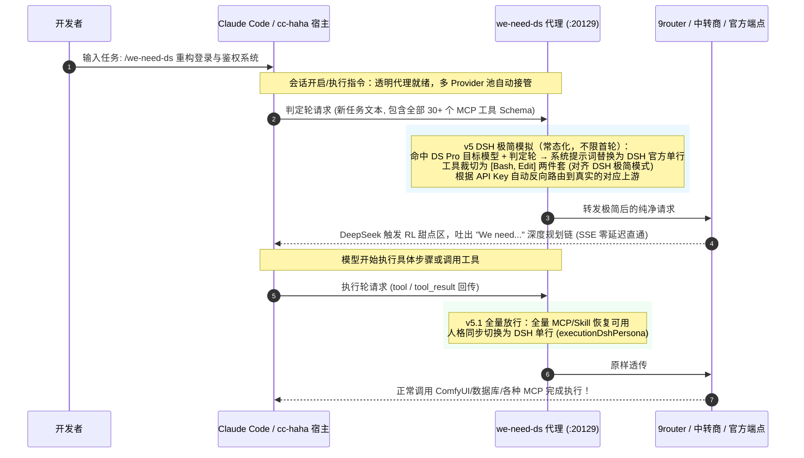

# we-need-ds 🎯

> **首个专为 Claude Code 与 [cc-haha](https://github.com/NanmiCoder/cc-haha) 打造的 DeepSeek Pro 满血 "We need" 深度思维链原生增强插件**

<p align="center">
  
  
  
  
  
</p>

[English Documentation](README_EN.md) | 简体中文

---

## 🧐 背景：为什么你的 DeepSeek 总是“不聪明”？

近期开源社区（参考 DeepSeek Harness 社区的深入研究）发现了一个极其关键的模型机制：**DeepSeek-V4-Pro 系列模型在不同工具上下文下的推理能力存在显著的“双面性”**：

| 模式 | 表现特征 | 核心原因 |
| :--- | :--- | :--- |
| 🟢 **"We need..." 满血深度规划** | 面对复杂工程任务，首先自发进行宏观全局拆解、边界推演、架构设计，展现极高水准的 AGI 战略规划能力。 | 模型首轮仅看到基础必要工具，触发 RL（强化学习）训练中的**深度推理甜点区**。 |
| 🔴 **"Let me..." 浅层工具试探** | 陷入微观琐碎的工具调用纠结，输出频繁试错、不断摸索，思维链退化为机械式的工具调用循环（Tool-Churning）。 | 客户端首轮注入数十个 MCP 工具、技能扩展、复杂 Schema，模型的注意力机制被过度牵引。 |

### 行业现状与生态空白
* **DSH 社区验证了原理，但 Claude Code 生态依然缺席**：现有的解决方案大多停留在 Python 独立运行脚本或专有终端框架中。
* **Claude Code 生态的巨大矛盾**：现代开发者在 Claude Code 中普遍挂载了大量 MCP 工具（数据库、浏览器、绘图、终端等）。如果为了诱导 "We need" 而手动把 MCP 全关掉，开发体验直接报废；如果不关，DeepSeek 就会永远陷在 "Let me" 的泥潭里。
* **提示词（Prompt 催眠）治标不治本**：无论在 System Prompt 里如何强调“请使用 We need 思考”，只要底层的 JSON 请求体里依然带有一长串复杂的 Tool Schemas，模型就会被注意力机制强制牵引回工具试探中。

---

## 💡 我们的解决方案：轮次结构感知动态解耦（Turn-Aware DSH Minimal Simulation, v5）

**`we-need-ds`** 是专为 Claude Code 与 [cc-haha](https://github.com/NanmiCoder/cc-haha) 原生设计的全自动增强插件，**无需关闭任何 MCP，零感知唤醒满血 DeepSeek**：



---

## ✨ 核心特性矩阵

1. **⚡ 全量 Provider 映射池与动态路由（Multi-Provider Pool & Dynamic Auth Routing）**：
   * 自动接管 `providers.json` 中的所有服务商（9Router、BAI、YJS、商汤、OpenCode 等）；
   * 收到请求时根据 API Key / Token 动态回源到各自真实的官方/中转上游地址，多窗口、多标签页切换模型零干扰。
2. **🎯 轮次结构感知极简模拟（Turn-Aware DSH Minimal, v5.1 全轮次人格统一）**：
   * 纯请求结构判定：末条为新 user 文本 = **判定轮**（等待模型规划），末条为 tool/tool_result = **执行轮**（工具续跑）；
   * **每个判定轮**（不限会话首轮）自动模拟 DeepSeek Harness 官方极简模式：系统提示词替换为 DSH 官方单行 `You are a helpful software engineer assistant.`，工具裁切为 `Bash + Edit` 两件套（映射 DSH 的 bash + str_replace_editor）；
   * **每个执行轮（v5.1）**保留全量工具放行，同时人格也切换为 DSH 单行——客户端只校验 JSON 协议结构（tool_use/tool_result），人格文本不做硬校验，替换协议安全；执行链结束后下一次新任务重新进入极简，全程零配置。`executionDshPersona: false` 可退回 v5 行为（执行轮完全透传）。
3. **🛡️ 三重防呆生命周期与无死锁保障**：
   * **自动启动挂载**：SessionStart 钩子开箱自启动；
   * **会话结束自动还原**：SessionEnd 钩子触发批量恢复；
   * **空闲 30 分钟守护自毁兜底**：无请求 30 分钟后自动退出，退出前必执行双重扫雷还原，绝无半死不活的残留死锁；
   * **非目标模型 100% 零侵入**：Claude / GPT / Gemini / Qwen 纯字节流直通。

---

## 📂 Claude Code 配置文件组织体系

```
~/.claude/                          # Claude Code 用户全局配置根目录
├── settings.json                   # 官方设置文件 (管理 enabledPlugins, permissions 等)
├── cc-haha/                        # cc-haha 定制目录 (https://github.com/NanmiCoder/cc-haha)
│   └── providers.json              # Provider 路由表 (baseUrl, activeId, 模型映射等)
└── plugins/                        # 插件系统根目录 (Plugin V2 规范)
    ├── installed_plugins.json      # 已安装插件注册表与 cache 映射
    ├── known_marketplaces.json     # 插件市场源列表
    └── cache/                      # 插件运行时隔离沙盒
        └── claude-plugins-official/
            └── we-need-ds/1.0.0/   # we-need-ds 运行时代码与状态文件
                ├── config.json     # 插件核心配置
                ├── proxy.js        # 拦截代理核心
                ├── lib/state.js    # 状态机与映射池
                ├── skills/         # 官方标准技能入口
                └── runtime-state.json # 运行时临时状态 (记录原始 URL 映射表)
```

---

## 🚀 使用指南

### 🅰️ 在 [cc-haha](https://github.com/NanmiCoder/cc-haha) 中使用（极致懒人模式）

1. **零配置开箱即用**：
   * 你的所有 Provider（9Router、YJS、商汤等）的 `baseUrl` 保持原本设置即可，无需任何手动改动！
2. **多窗口自由切换**：
   * 插件自动进行全量多 Provider 接管，你在任何窗口任意切换服务商，均可直接触发。
3. **日常使用**：
   * 在聊天框直接输入：
     ```bash
     /we-need-ds 帮我重构用户鉴权模块并编写测试用例
     ```
   * 想要先行进行深度推演不写代码时：
     ```bash
     /we-need-ds:plan 规划大型系统重构方案
     ```

---

### 🅱️ 在纯正官方 Claude Code 中使用

1. **设置上游与代理**：
   * 在环境变量中指定上游中转地址（如 9router 或商业 API）：
     ```bash
     export ANTHROPIC_UPSTREAM_BASE_URL="http://127.0.0.1:20128"
     ```
   * 将 Claude Code 端点指向 `we-need-ds` 代理：
     ```bash
     export ANTHROPIC_BASE_URL="http://127.0.0.1:20129"
     ```
2. **运行与体验**：
   * 正常启动 `claude` 即可，所有 `deepseek-v4-pro*` 判定轮请求自动进入 DSH 极简环境触发 "We need" 思维链，工具执行轮全量放行，其他模型（Claude / GPT / Gemini 等）全量透传直通。

---

## 🎮 命令矩阵全景

| 技能命令 | 功能说明 | 典型使用场景 |
| :--- | :--- | :--- |
| **`/we-need-ds <任务>`** | **一键启动满血思维链并执行** | 默认主入口，附带任务，自动开启拦截并执行 |
| **`/we-need-ds:plan <任务>`** | **调用只读规划专家子代理** | 超大项目、重构任务，想先看 Markdown 蓝图而不动代码 |
| **`/we-need-ds:doctor`** | **一键深度体检** | 排查代理端口、环境模式、25 个 Provider 池接管与连通状态 |
| **`/we-need-ds:test`** | **运行轮次结构感知自测试套件** | 12 组包含判定轮极简、执行轮放行、非目标模型透传的完整断言 |
| **`/we-need-ds:status`** | **查看当前运行与拦截状态** | 查看当前代理进程、拦截开关、被接管的提供商清单与日志 |
| **`/we-need-ds:on`** | **手动开启拦截环境** | 显式开启全量接管，判定轮常态进入极简模拟 |
| **`/we-need-ds:off`** | **手动关闭拦截并还原端点** | 随时手动将所有 Provider 恢复到各自原有的真实地址 |

---

## ⚙️ 配置文件说明 (`config.json`)

```json
{
  "port": 20129,
  "targetBaseUrl": "auto",
  "targetModels": [
    "deepseek-v4-pro-0813",
    "deepseek-v4-pro"
  ],
  "bootstrapCoreTools": [
    "Bash",
    "Edit"
  ],
  "logDetails": false,
  "idleAutoShutdownMinutes": 30,
  "executionDshPersona": true
}
```

* `targetBaseUrl`：默认为 `"auto"`，自动按 Token 动态路由回各 Provider 原地址；
* `targetModels`：需要触发拦截的模型列表（内置正则归一化引擎，无论下划线、空格、连字符还是路径前缀均能精准匹配）；
* `bootstrapCoreTools`：判定轮保留的极简工具集（默认 `Bash, Edit`，对齐 DSH 极简模式的 bash + str_replace_editor 两件套）；
* `idleAutoShutdownMinutes`：无请求空闲退出时间（默认 30 分钟，退出前会自动安全还原配置）；
* `executionDshPersona`：执行轮是否同步切换 DSH 人格（默认 `true`；设为 `false` 退回执行轮完全透传）。

---

## 📄 开源许可证

本项目基于 [MIT License](LICENSE) 开源。欢迎提交 PR 与 Issue！

**作者**: [YixuAn](https://github.com/YixuAnsensei)
**鸣谢**: [cc-haha 客户端项目](https://github.com/NanmiCoder/cc-haha) & DeepSeek Harness (DSH) 社区
