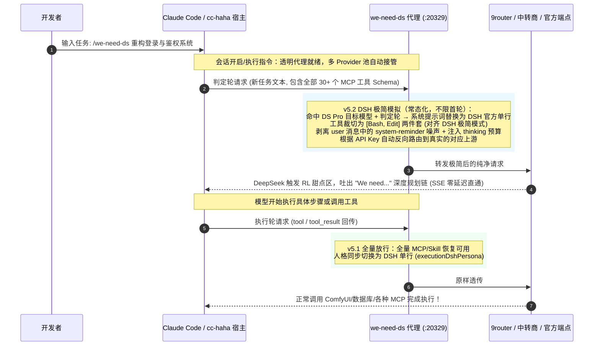

# we-need-ds 🎯

> **首个专为 Claude Code 与 [cc-haha](https://github.com/NanmiCoder/cc-haha) 打造的 DeepSeek Pro 满血 "We need" 深度思维链原生增强插件**

<p align="center">
  
  
  
  
  
</p>

[English Documentation](README_EN.md) | 简体中文

---

## 🧐 背景：为什么你的 DeepSeek 总是“不聪明”？

近期开源社区（参考 DeepSeek Harness 社区的深入研究）发现了一个极其关键的模型机制：**DeepSeek-V4-Pro 系列模型在不同工具上下文下的推理能力存在显著的“双面性”**：

| 模式 | 表现特征 | 核心原因 |
| :--- | :--- | :--- |
| 🟢 **"We need..." 满血深度规划** | 面对复杂工程任务，首先自发进行宏观全局拆解、边界推演、架构设计，展现极高水准的 AGI 战略规划能力。 | 模型首轮仅看到基础必要工具，触发 RL（强化学习）训练中的**深度推理甜点区**。 |
| 🔴 **"Let me..." 浅层工具试探** | 陷入微观琐碎的工具调用纠结，输出频繁试错、不断摸索，思维链退化为机械式的工具调用循环（Tool-Churning）。 | 客户端首轮注入数十个 MCP 工具、技能扩展、复杂 Schema，模型的注意力机制被过度牵引。 |

### 行业现状与生态空白
* **DSH 社区验证了原理，但 Claude Code 生态依然缺席**：现有的解决方案大多停留在 Python 独立运行脚本或专有终端框架中。
* **Claude Code 生态的巨大矛盾**：现代开发者在 Claude Code 中普遍挂载了大量 MCP 工具（数据库、浏览器、绘图、终端等）。如果为了诱导 "We need" 而手动把 MCP 全关掉，开发体验直接报废；如果不关，DeepSeek 就会永远陷在 "Let me" 的泥潭里。
* **提示词（Prompt 催眠）治标不治本**：无论在 System Prompt 里如何强调“请使用 We need 思考”，只要底层的 JSON 请求体里依然带有一长串复杂的 Tool Schemas，模型就会被注意力机制强制牵引回工具试探中。

---

## 💡 我们的解决方案：轮次结构感知动态解耦（Turn-Aware DSH Minimal Simulation, v5.2）

**`we-need-ds`** 是专为 Claude Code 与 [cc-haha](https://github.com/NanmiCoder/cc-haha) 原生设计的全自动增强插件，**无需关闭任何 MCP，零感知唤醒满血 DeepSeek**：



---

## ✨ 核心特性矩阵

1. **⚡ 单服务商接管 + 直连副本逃生口（Single-Provider Hook & Direct-Copy Escape）**：
   * 只接管 `providers.json` 中**当前默认（activeId）且确实提供 DeepSeek Pro 模型**的那一个服务商，其余服务商的 `baseUrl` 一律不动，保持各自真实上游；
   * 接管的同时，为该服务商复制一份带 `· 直连副本` 后缀的临时 provider，其 `baseUrl` 指向**原始真实上游**——这就是逃生口：万一 daemon 死掉、本体指向死端口，你在 cc-haha 里切到副本即可立刻直连，再从容 `off`/`boot`/`on`；
   * 副本同时充当**冗余账本**：即使 `runtime-state.json` 丢失/损坏，也能从副本的 `baseUrl` 把本体救回真实上游；
   * 收到请求时根据 API Key / Token 动态回源到真实上游地址，多窗口、多标签页切换模型零干扰。
2. **🎯 轮次结构感知极简模拟（Turn-Aware DSH Minimal, v5.2 判定轮满血触发）**：
   * 纯请求结构判定：末条为新 user 文本 = **判定轮**（等待模型规划），末条为 tool/tool_result = **执行轮**（工具续跑）；
   * **每个判定轮**（不限会话首轮）自动模拟 DeepSeek Harness 官方极简模式：系统提示词替换为 DSH 官方单行 `You are a helpful software engineer assistant.`，工具裁切为 `Bash + Edit` 两件套（映射 DSH 的 bash + str_replace_editor）；**v5.2 新增**：剥离 user 消息中的 `<system-reminder>` 噪声块（对照实验证明 reminder 噪声会压灭思维链），并在 Anthropic 路径注入 `thinking` 预算（对照实验证明 thinking 字段缺失即无法触发 "We need"）；
   * **每个执行轮（v5.1）**保留全量工具放行，同时人格也切换为 DSH 单行——客户端只校验 JSON 协议结构（tool_use/tool_result），人格文本不做硬校验，替换协议安全；执行链结束后下一次新任务重新进入极简，全程零配置。`executionDshPersona: false` 可退回 v5 行为（执行轮完全透传）。
3. **🛡️ 多重防呆生命周期与无死锁保障**：
   * **宿主钩子自动接管**：SessionStart 钩子拉起 daemon 并**仅在账本 `enabled`（你此前执行过 `on` 且未 `off`）时**自动重接管；UserPromptSubmit 钩子每条新消息自检复活；SessionEnd 钩子会话结束把指向代理的 provider 还原直连但**保留拦截意图**（下个会话自动重接管）——想永久关闭请显式执行 `/we-need-ds:off`（在支持插件 hooks 的宿主上生效）；
   * **重启后手动恢复（不依赖宿主钩子，不做系统级注册）**：Windows 关机/重启会直接杀死 daemon 且绕过所有钩子，被接管的本体会停留在指向死代理端口的"孤儿"状态。但**其余服务商和直连副本始终直连**，所以你总能发消息、也能跑恢复命令——不再有"全部指向死端口、连 on 都发不出"的死锁。恢复：在 cc-haha 切到直连副本（或任意未接管的 provider）后执行 `/we-need-ds:on`（或终端 `node lib/ctl.js boot`）——拉起 daemon + 修复孤儿 + 按账本重新接管。本插件不注册计划任务、不写 Startup 文件夹，卸载即干净（见下方"重启后的手动恢复"）；
   * **常驻守护**：daemon 默认常驻不退出（`idleAutoShutdownMinutes: 0`）；
   * **非目标模型 100% 零侵入**：Claude / GPT / Gemini / Qwen 纯字节流直通。

---

## 📂 Claude Code 配置文件组织体系

```
~/.claude/                          # Claude Code 用户全局配置根目录
├── settings.json                   # 官方设置文件 (管理 enabledPlugins, permissions 等)
├── cc-haha/                        # cc-haha 定制目录 (https://github.com/NanmiCoder/cc-haha)
│   └── providers.json              # Provider 路由表 (baseUrl, activeId, 模型映射等)
├── we-need-ds/                     # 插件集中数据目录 (跨版本持久化)
│   ├── runtime-state.json          # 运行时账本 (原始 URL 映射表 / keyMap / 拦截开关)
│   └── we-need-ds.log              # 运行日志
└── plugins/                        # 插件系统根目录 (Plugin V2 规范)
    ├── installed_plugins.json      # 已安装插件注册表与 cache 映射
    ├── known_marketplaces.json     # 插件市场源列表
    └── cache/                      # 插件运行时隔离沙盒
        └── claude-plugins-official/
            └── we-need-ds/<version>/   # we-need-ds 运行时代码
                ├── config.json     # 插件核心配置
                ├── proxy.js        # 拦截代理核心
                ├── lib/state.js    # 状态机与映射池
                └── skills/         # 官方标准技能入口
```

---

## 🚀 使用指南

### 🅰️ 在 [cc-haha](https://github.com/NanmiCoder/cc-haha) 中使用

> **⚠️ 先读：接管会改写 providers.json，且关机/重启后依然保留**
> 本插件的接管方式是**把被选中 provider 的 `baseUrl` 改写为本地代理地址**（`http://127.0.0.1:20329`）。这个改写写进的是 cc-haha 的配置文件 `~/.claude/cc-haha/providers.json`，**关机、重启、关闭 cc-haha 都不会自动撤销它**。因此：
> - 只要 daemon 还活着，一切正常；
> - 若 daemon 死了（重启会直接杀死它）而本体还指向代理端口，那个 provider 就"连不上"了——但**不会全盘卡死**：接管时插件同时生成了一份 `· 直连副本`（`baseUrl` 指向你的原始真实上游），其余未被接管的 provider 也全部保持直连。你随时可以切到副本或任意未接管 provider 发消息、并跑恢复命令。
> - **养成习惯**：退出 cc-haha / 关机前执行一次 `/we-need-ds:off`，把本体还原直连、清除副本，账本干净。忘了也没关系，见下方"重启后的手动恢复"。

1. **选择要接管哪个服务商（两种方式，二选一）**：
   * **方式 A · 插件代选（推荐，无需手动预设置）**：直接执行 `/we-need-ds:on` 或 `/we-need-ds`，插件会先列出你配置的所有 provider（标注哪个含 DeepSeek Pro 模型 `🎯`、哪个是当前默认 `⭐`），若含 DS 模型的有多个会让你选一个，然后接管它。**接管非默认 provider 时插件会自动把 cc-haha 的 `activeId` 切到它**——因为 sidecar 按 `activeId` 路由，不同步切换的话新会话仍会走旧 provider。
   * **方式 B · 手动预设置**：先在 cc-haha 里把你真正要用的那个 DeepSeek Pro 服务商设为默认，再执行 `/we-need-ds:on`（省略 `--provider`），插件直接接管当前默认。
   * 终端等价命令：`node lib/ctl.js list` 查看清单；`node lib/ctl.js on --provider <id 或名称>` 指定接管目标。
   * **接管与否只看该 provider 声明的 `models` 字段**：插件读取 `providers.json` 里这个服务商的 `models`（main/haiku/sonnet/opus 等映射），只要其中任一模型名命中 DeepSeek Pro 判定（在 `targetModels` 列表内，或含 `deepseek` 字样、或含独立的 `ds` 词元（前后为分隔符/边界，避免 `models`/`adsl` 之类子串误伤）且同时含 `v4|pro|flash` 特征）才接管。像 9Router 这类中转站，即使它**实际能转发** DeepSeek 模型，只要它的 `models` 字段里没写 deepseek 系模型名，插件就判定它"非 DS provider"而**不接管**（保持直连、不裁剪）。所以请选择 `models` 里确实声明了 DeepSeek Pro 模型的服务商。
   * 其余服务商的 `baseUrl` 一律不动，保持各自真实上游——这正是防死锁的关键：daemon 万一死了，你还有大量直连入口和自动生成的直连副本可切换。
2. **开启即接管 + 建副本**：
   * 执行 `/we-need-ds:on`（或 `on --provider <id>`）：拉起 daemon、把目标 DS 服务商的 `baseUrl` 切到代理端口、并复制一份 `· 直连副本`（指向原始真实上游）作为逃生口。
   * 切换接管目标后再 `on`：旧本体自动还原直连、新目标被接管，副本始终只保留一份。
3. **退出前手动 off（推荐习惯）**：
   * 关闭 cc-haha / 关机前执行 `/we-need-ds:off`，把本体还原直连并清除副本，账本干净。即便忘了 off，重启后也能从副本或任意未接管 provider 直连发消息、再跑 `boot`/`on` 恢复，不会卡死。
4. **日常使用**：
   * 在聊天框直接输入：
     ```bash
     /we-need-ds 帮我重构用户鉴权模块并编写测试用例
     ```
   * 想要先行进行深度推演不写代码时：
     ```bash
     /we-need-ds:plan 规划大型系统重构方案
     ```

---

### 🅱️ 在纯正官方 Claude Code 中使用

1. **设置上游与代理**：
   * 在环境变量中指定上游中转地址（如 9router 或商业 API）：
     ```bash
     export ANTHROPIC_UPSTREAM_BASE_URL="http://127.0.0.1:20128"
     ```
   * 将 Claude Code 端点指向 `we-need-ds` 代理：
     ```bash
     export ANTHROPIC_BASE_URL="http://127.0.0.1:20329"
     ```
2. **运行与体验**：
   * 正常启动 `claude` 即可，所有 `deepseek-v4-pro*` 判定轮请求自动进入 DSH 极简环境触发 "We need" 思维链，工具执行轮全量放行，其他模型（Claude / GPT / Gemini 等）全量透传直通。

---

## 🎮 命令矩阵全景

| 技能命令 | 功能说明 | 典型使用场景 |
| :--- | :--- | :--- |
| **`/we-need-ds <任务>`** | **一键启动满血思维链并执行** | 默认主入口，附带任务，自动开启拦截并执行 |
| **`/we-need-ds:plan <任务>`** | **调用只读规划专家子代理** | 超大项目、重构任务，想先看 Markdown 蓝图而不动代码 |
| **`/we-need-ds:doctor`** | **一键深度体检** | 排查代理端口、环境模式、Provider 池接管与连通状态 |
| **`/we-need-ds:test`** | **运行轮次结构感知自测试套件** | 覆盖判定轮极简、执行轮放行、非目标模型透传、M1/M3 边界、非 DS 安全底线的完整断言 |
| **`/we-need-ds:status`** | **查看当前运行与拦截状态** | 查看当前代理进程、拦截开关、被接管的提供商清单与日志 |
| **`/we-need-ds:list`** | **列出全部 provider 及接管建议** | 查看每个 provider 是否含 DS 模型、哪个是当前默认、哪个已在代理中，再决定接管谁 |
| **`/we-need-ds:on`** | **手动开启拦截环境** | 默认接管当前默认 DS 服务商；`on --provider <id>` 可指定接管任意含 DS 模型的服务商（自动同步 activeId）并建直连副本 |
| **`/we-need-ds:off`** | **手动关闭拦截并还原端点** | 还原被接管的本体到真实上游并清除直连副本 |
| **`/we-need-ds:restart`** | **优雅重启代理 daemon** | 代理卡死（如被大量挂起的上游请求占满）或更新代码后需重载时：杀旧进程→拉起新 daemon→按账本自动重新接管 |

---

## 🔌 重启后的手动恢复（本插件不做任何系统级注册）

Windows 关机/重启会**直接杀死 daemon 进程**，且绕过所有会话钩子——被接管的本体会停留在指向死代理端口的"孤儿"状态。本插件**刻意不做任何系统层面的持久化**（不注册计划任务、不写 Startup 文件夹）：插件就应该是插件，装完不偷偷改系统，卸载即干净。

**v2.2.0 起死锁已被根治**：代理只接管当前默认的那一个服务商，其余服务商和自动生成的 `· 直连副本` 始终保持直连。所以重启后哪怕 daemon 死了，你依然能正常发消息（走任意未接管 provider 或副本），恢复命令也发得出去——不再有"全部指向死端口、连 on 都发不出"的死锁。

因此**电脑重启后、或 cc-haha / Claude Code 完全重开后**，需要显式启动一次拦截（和平时用 skill 的方式一样）：

- 在 Claude Code 里执行 `/we-need-ds:on` —— 拉起 daemon + 修复孤儿 + 按账本接管，一步到位；
- 或在终端跑 `node "<CACHE>\lib\ctl.js" boot` —— 不依赖宿主的等价恢复命令，读账本 `enabled` 状态自愈（开启态拉起 daemon + 修复孤儿 + 重新接管，关闭态清理残留）。

会话进行中的自愈（UserPromptSubmit 钩子：每条新消息自检 daemon、死亡则复活重接管）在支持插件 hooks 的宿主（如原生 Claude Code）上仍然生效，与上述手动启动不冲突。cc-haha 的 sidecar 是常驻 server 模式、不执行插件 hooks，所以 cc-haha 下以手动 `on`/`boot` 为准。

**失败即还原（防死锁）**：任何恢复路径（`on` / `boot` / 钩子）如果拉起 daemon 失败，都会把仍指向代理端口的 provider **自动还原为真实上游直连**——绝不留"端点指向死代理、用户无法使用、恢复命令也发不出"的死锁状态。还原不是单向的：**下一条消息若账本 `enabled` 且 daemon 存活、无 provider 被接管，UserPromptSubmit 钩子会自动重新接管**——恢复后的第一轮立即回到代理+裁剪。`status` / `doctor` 若检测到 provider 指向代理端口但 daemon 未运行，会打印醒目告警并给出恢复命令。

---

## ⚙️ 配置文件说明 (`config.json`)

```json
{
  "port": 20329,
  "targetBaseUrl": "auto",
  "targetModels": [
    "deepseek-v4-pro-0813",
    "deepseek-v4-pro",
    "deepseek-v4-flash",
    "deepseek-v4-flash-0731"
  ],
  "bootstrapCoreTools": [
    "Bash",
    "Edit"
  ],
  "logDetails": false,
  "idleAutoShutdownMinutes": 0,
  "executionDshPersona": true,
  "thinkingBudget": 8000,
  "upstreamRetries": 1,
  "upstreamRetryBackoffMs": 500,
  "upstreamHeaderTimeoutMs": 30000,
  "upstreamBodyTimeoutMs": 30000,
  "upstreamIdleTimeoutMs": 600000
}
```

| 配置项 | 默认值 | 说明 |
| :--- | :--- | :--- |
| `port` | `20329` | 本地透明代理监听端口（仅绑定 127.0.0.1）。若被其他程序占用请改此值；测试环境变量 `WE_NEED_DS_TEST_PORT` 可临时覆盖，不影响生产配置。 |
| `targetBaseUrl` | `"auto"` | 上游解析策略。`"auto"` = 按请求携带的 API Key 在账本中动态路由回各 Provider 真实上游；设为具体 URL 则强制所有请求回源到该地址。 |
| `targetModels` | DS V4 全家桶 | 需要触发拦截处理的模型列表（内置归一化引擎，下划线/空格/连字符/路径前缀/大小写变体均能精准匹配）。**列表之外的模型（Claude / GPT / Gemini / Qwen 等）一律字节级原样透传，绝不修改。** |
| `bootstrapCoreTools` | `["Bash","Edit"]` | 判定轮保留的极简工具集（对齐 DSH 极简模式的 bash + str_replace_editor 两件套）。此外，会话历史中已被调用过的工具也会自动保留，防止协议校验失败。 |
| `logDetails` | `false` | 设为 `true` 时在日志中记录每个透传请求的 URL 与上游（调试路由问题用）。 |
| `idleAutoShutdownMinutes` | `0` | 空闲自动释放开关。默认 `0` = 常驻不退出；设为正数 N 则代理空闲超过 N 分钟后自动还原所有 Provider 并退出，下次新消息由 UserPromptSubmit 钩子自动拉起并重新接管。 |
| `executionDshPersona` | `true` | 执行轮（工具续跑）是否也同步切换为 DSH 极简人格。默认 `true`（全程 DSH 人格，仅工具集不同）；设为 `false` 则执行轮完全原样透传（保留 Claude Code 原始人格）。 |
| `thinkingBudget` | `8000` | 判定轮注入的 Anthropic extended thinking 预算。实测对照实验证明：`thinking` 字段**必须存在**才能触发 "We need" 思维链（budget 大小无所谓，但字段缺失即失败）。默认 `8000` = 判定轮在 Anthropic 路径注入 `thinking: {type:"enabled", budget_tokens:8000}`；设 `0` 关闭注入。内置 `max_tokens` 守卫：宿主小 `max_tokens` 请求（如标题生成，≤ budget）自动跳过注入，避免 `max_tokens > budget_tokens` 的 400。OpenAI 路径始终不注入（防中转站 400）。 |
| `stripSystemPersona` | *(缺省=生效)* | 人格替换总开关。默认所有命中 DS 目标模型的请求都替换为 DSH 单行人格；显式设为 `false` 可完全关闭人格替换（仅保留工具裁切）。 |
| `upstreamRetries` | `1` | 上游不稳定时的重试次数（不含首次，默认共 2 次尝试）。**只对可重试失败重试**：空 body、连接被重置、408/409/425/429、5xx、超时；确定性错误（DNS 解析失败 ENOTFOUND、主机不可达、非法 URL 等）**不重试直接失败**——这类错误重试只会叠加延迟。客户端断开后不再发起任何重试。代理刻意保守：上游本身可能已有重试，代理再叠多重试会放大成重试风暴。设为 `0` 关闭重试。 |
| `upstreamRetryBackoffMs` | `500` | 重试退避基数（毫秒），按 2 的幂递增（500→1000→…），总封顶 60s；若上游返回 `Retry-After` 头则取两者较大值（`Retry-After` 被 clamp 到 0–60s，防恶意/异常头把代理挂死）。 |
| `upstreamHeaderTimeoutMs` | `30000` | **响应头超时**（毫秒）。请求发出后若上游在此时间内连响应头都没返回（连接级挂起），判定为可重试失败，快速失败而非拖到 socket 硬超时。 |
| `upstreamBodyTimeoutMs` | `30000` | **非流式 body 超时**（毫秒）。仅对非流式（`Content-Type` 不是 `text/event-stream`）响应生效：头已到但在此时间内一个 body 字节都没有（"只发头不发体"的挂起），判定为可重试失败。**流式响应不受此门约束**——推理模型（如 deepseek-v4-pro）首 token 可能合法地慢到几十秒甚至更久，头到齐后代理会无限等待首字节，绝不误杀。 |
| `upstreamIdleTimeoutMs` | `600000` | **socket 空闲超时**（毫秒）。上游连接上连续无任何活动达到该时长即判定为死连接并销毁（默认 10 分钟，覆盖长思考链的流式静默期）。 |

---

## ⚠️ 边界与注意事项

1. **账本信任链**：插件把 provider 的 `baseUrl` 改写为代理地址时，会把"改写瞬间的 baseUrl"记为真实上游（`originalUrl`）。因此**请确保 cc-haha 里每个 provider 的 baseUrl 指向的是真实上游**（官方端点或你自己的中转，如 9router 的 `:20128`）。若你把某个 provider 手动配成了**另一个代理地址**，插件会把这个代理地址当作真实上游记录并还原——这是设计边界，不是 bug。开启拦截前用 `/we-need-ds:doctor` 核对各 provider 的原始上游是否符合预期。
2. **两条版本编号线**：README 与文档中反复出现的 **v5 / v5.1 / v5.2** 指的是**机制版本**（轮次感知 DSH 极简模拟这套算法的演进代号）；插件本身遵循 **semver**（见 `plugin.json` 与 CHANGELOG，当前 `2.4.x`）。两者独立编号：机制 v5.2 对应插件 2.4.3。GitHub Releases 以 semver 为准。
3. **端口占用**：代理默认绑定 `127.0.0.1:20329`。若被占用请改 `config.json` 的 `port`；插件在端口变更时会自动把指向旧端口的 provider 先还原再按新端口接管，不会把代理地址误记为真实上游。
4. **测试隔离（跑测试套件必读）**：自测试套件会改写 providers.json 与 runtime-state.json。为避免污染你正在使用的生产环境，跑测试前务必设置三个隔离环境变量，让测试全程读写临时目录、绝不碰生产文件：`WE_NEED_DS_TEST_PORT`（测试端口）、`WE_NEED_DS_PROVIDERS_PATH`（临时 providers.json 路径）、`WE_NEED_DS_DATA_DIR`（临时数据目录）。`test_full.js` / `test_consume.js` 已内置自动隔离（用 `os.tmpdir()` 临时目录），直接 `node test_full.js` 即可；手动跑 `ctl on/off` 等接管命令时若不想碰生产，同样设这三个变量。

---

## 📄 开源许可证

本项目基于 [MIT License](LICENSE) 开源。欢迎提交 PR 与 Issue！

**作者**: [YixuAn](https://github.com/YixuAnsensei)
**鸣谢**: [cc-haha 客户端项目](https://github.com/NanmiCoder/cc-haha) & DeepSeek Harness (DSH) 社区

---

## ☕ 请作者喝杯奶茶

如果这个项目对你有帮助，欢迎点个 Star，也可以请我喝一杯奶茶~

<p align="center">
  
</p>

> 赞赏纯属自愿，你的 Star 就是对项目最大的支持 ⭐
