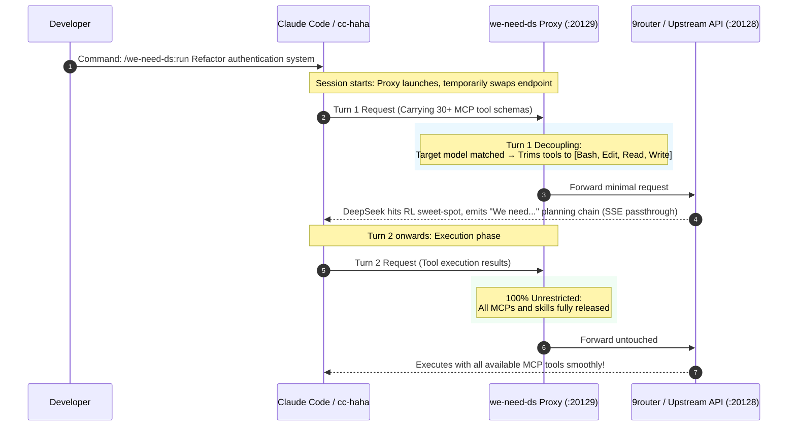

# we-need-ds 🎯

> **The first native Claude Code & [cc-haha](https://github.com/NanmiCoder/cc-haha) plugin for unlocking full-power "We need" reasoning chains in DeepSeek Pro models.**

<p align="center">
  
  
  
  
  
</p>

[简体中文文档](README.md) | English Documentation

---

## 🧐 Background: The "We need" vs "Let me" Dilemma

Recent community research (pioneered by the DeepSeek Harness community) revealed a critical duality in **DeepSeek-V4-Pro series models** under different tool schemas:

| Mode | Characteristics | Root Cause |
| :--- | :--- | :--- |
| 🟢 **"We need..." Full-Power Deep Planning** | Deconstructs problems globally, plans architecture, handles edge cases, and demonstrates top-tier AGI-level strategic reasoning. | Model only sees a minimal essential toolset in turn 1, entering its RL **deep reasoning sweet-spot**. |
| 🔴 **"Let me..." Shallow Tool-Churning** | Gets bogged down in micro-level tool trials, excessive looping, and shallow heuristics. | Client injects dozens of MCP tools, skill schemas, and verbose docs in turn 1, over-directing attention. |

### The Problem in Claude Code Ecosystem
* **Claude Code developers rely heavily on MCPs** (databases, browsers, terminals, file editors). Disabling them manually destroys the workflow, but leaving them enabled traps DeepSeek in the "Let me" trap.
* **Prompt hypnosis fails**: System prompts cannot overcome the raw attention weight of dozens of JSON tool schemas in the request body.

---

## 💡 The Solution: Two-Phase Dynamic Bootstrap

**`we-need-ds`** provides a transparent, zero-latency proxy plugin that dynamically decouples tool exposure across conversation phases:



---

## 🚀 Getting Started

### 🅰️ Using with [cc-haha](https://github.com/NanmiCoder/cc-haha) (Zero Config)

[cc-haha](https://github.com/NanmiCoder/cc-haha) is a widely popular enhanced Claude Code client with multi-provider routing.

1. **Zero configuration required**: Keep your provider `baseUrl` pointing to your normal 9router / API port (e.g., `http://localhost:20128`).
2. **Automatic Lifecycle**:
   * The plugin automatically swaps `providers.json` active provider's `baseUrl` to `127.0.0.1:20129` during session runtime.
   * Upon session exit or 30-minute idle shutdown, it automatically restores the original URL.
3. **Usage**:
   ```
   /we-need-ds:run Build a complete unit test suite for the payment service
   ```

---

### 🅱️ Using with Official Vanilla Claude Code

1. Set your upstream and proxy environment variables:
   ```bash
   export ANTHROPIC_UPSTREAM_BASE_URL="http://127.0.0.1:20128"
   export ANTHROPIC_BASE_URL="http://127.0.0.1:20129"
   ```
2. Start `claude` normally. Turn-1 requests for `deepseek-v4-pro*` will trigger "We need" reasoning while all other models (Claude 3.7, GPT, Gemini) pass through 100% untouched.

---

## 🎮 Command Matrix

| Slash Command | Description | Typical Use Case |
| :--- | :--- | :--- |
| **`/we-need-ds:run <task>`** | **Run with full-power reasoning** | Primary entry point: activates interception and executes task |
| **`/we-need-ds:plan <task>`** | **Read-only planning agent** | Summons `we-need-planner` to survey and generate Markdown blueprint |
| **`/we-need-ds:doctor`** | **Health diagnostic** | Checks port, 9router reachability, provider configuration |
| **`/we-need-ds:test`** | **Run test simulation suite** | Runs 9 assertions verifying normalization and tool trimming |
| **`/we-need-ds:status`** | **Inspect runtime status** | Shows daemon state, upstream URL, and log location |
| **`/we-need-ds:on`** | **Force enable interception** | Manually points active provider to proxy port |
| **`/we-need-ds:off`** | **Force disable interception** | Manually restores original baseUrl |

---

## ⚙️ Configuration (`config.json`)

```json
{
  "port": 20129,
  "targetBaseUrl": "auto",
  "targetModels": [
    "deepseek-v4-pro-0813",
    "deepseek-v4-pro"
  ],
  "bootstrapCoreTools": [
    "Bash",
    "Edit",
    "Read",
    "Write"
  ],
  "bootstrapBudget": 0,
  "logDetails": false,
  "idleAutoShutdownMinutes": 30
}
```

* `targetBaseUrl`: Defaults to `"auto"` to seamlessly track the active provider's upstream.
* `targetModels`: List of targeted models (fuzzy normalized regex matcher).
* `bootstrapCoreTools`: Minimal toolset exposed during Turn-1 (default: `Bash, Edit, Read, Write`).
* `bootstrapBudget`: **Turn-1 maximum completion tokens limit (default `0` = follow client default)**.
* `idleAutoShutdownMinutes`: Auto shutdown idle timeout in minutes (default 30 mins, automatically restores config before exit).

---

## 📄 License

MIT License. Authored by [YixuAn](https://github.com/YixuAnsensei).  
Special thanks to [cc-haha](https://github.com/NanmiCoder/cc-haha) and the DeepSeek Harness community.
