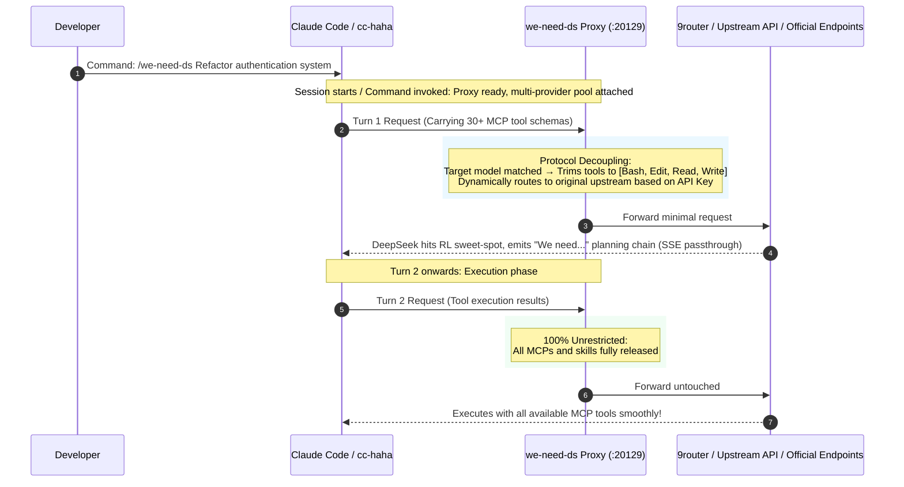

# we-need-ds 🎯

> **The first native Claude Code & [cc-haha](https://github.com/NanmiCoder/cc-haha) plugin for unlocking full-power "We need" reasoning chains in DeepSeek Pro models.**

<p align="center">
  
  
  
  
  
</p>

[简体中文文档](README.md) | English Documentation

---

## 🧐 Background: The "We need" vs "Let me" Dilemma

Recent community research (pioneered by the DeepSeek Harness community) revealed a critical duality in **DeepSeek-V4-Pro series models** under different tool schemas:

| Mode | Characteristics | Root Cause |
| :--- | :--- | :--- |
| 🟢 **"We need..." Full-Power Deep Planning** | Deconstructs problems globally, plans architecture, handles edge cases, and demonstrates top-tier AGI-level strategic reasoning. | Model only sees a minimal essential toolset in turn 1, entering its RL **deep reasoning sweet-spot**. |
| 🔴 **"Let me..." Shallow Tool-Churning** | Gets bogged down in micro-level tool trials, excessive looping, and shallow heuristics. | Client injects dozens of MCP tools, skill schemas, and verbose docs in turn 1, over-directing attention. |

### The Problem in Claude Code Ecosystem
* **Claude Code developers rely heavily on MCPs** (databases, browsers, terminals, file editors). Disabling them manually destroys the workflow, but leaving them enabled traps DeepSeek in the "Let me" trap.
* **Prompt hypnosis fails**: System prompts cannot overcome the raw attention weight of dozens of JSON tool schemas in the request body.

---

## 💡 The Solution: Two-Phase Dynamic Bootstrap

**`we-need-ds`** provides a transparent, zero-latency proxy plugin that dynamically decouples tool exposure across conversation phases:



---

## ✨ Key Features

1. **⚡ Multi-Provider Pool & Dynamic Auth Routing**:
   * Automatically hooks all provider instances in `providers.json` (9Router, BAI, YJS, SenseTime, OpenCode, etc.).
   * Dynamically resolves and routes incoming requests back to each provider's real upstream URL using API Key / Auth headers. Switching providers across tabs works seamlessly.
2. **🎯 One-shot Force Trigger**:
   * When switching to DeepSeek Pro mid-session in a long conversation, invoking `/we-need-ds <task>` or `/we-need-ds:on` arms a **one-shot trigger**.
   * Only the immediate current turn is trimmed to 4 tools to force deep reasoning; the trigger is consumed immediately, and all subsequent turns enjoy 100% unrestricted tool access.
3. **🛡️ Triple Safety Lifecycle & Zero-Deadlock Guarantee**:
   * **Auto Hook on Start**: SessionStart hook initializes background proxy.
   * **Auto Restore on Exit**: SessionEnd hook restores all provider URLs.
   * **30-Min Idle Self-Destruct**: After 30 minutes of inactivity, the proxy daemon restores all provider URLs and exits cleanly.
   * **100% Zero-Touch for Non-Target Models**: Claude, GPT, Gemini, Qwen models pass through with pure byte-level streaming.

---

## 🚀 Getting Started

### 🅰️ Using with [cc-haha](https://github.com/NanmiCoder/cc-haha) (Zero Config)

1. **Zero configuration required**: Keep your provider `baseUrl` pointing to your normal 9router / API port (e.g., `http://localhost:20128`).
2. **Multi-window flexibility**: The plugin manages all providers concurrently.
3. **Usage**:
   ```bash
   /we-need-ds Build a complete unit test suite for the payment service
   ```
   Or for pure architecture planning without modifying code:
   ```bash
   /we-need-ds:plan Plan large scale refactoring
   ```

---

### 🅱️ Using with Official Vanilla Claude Code

1. Set your upstream and proxy environment variables:
   ```bash
   export ANTHROPIC_UPSTREAM_BASE_URL="http://127.0.0.1:20128"
   export ANTHROPIC_BASE_URL="http://127.0.0.1:20129"
   ```
2. Start `claude` normally. Turn-1 requests for `deepseek-v4-pro*` will trigger "We need" reasoning while all other models (Claude 3.7, GPT, Gemini) pass through 100% untouched.

---

## 🎮 Command Matrix

| Skill Command | Description | Typical Use Case |
| :--- | :--- | :--- |
| **`/we-need-ds <task>`** | **Execute with full-power reasoning** | Primary entry point: arms one-shot trigger and runs task |
| **`/we-need-ds:plan <task>`** | **Read-only planning agent** | Summons `we-need-planner` to generate Markdown blueprint |
| **`/we-need-ds:doctor`** | **Health diagnostic** | Inspects proxy port, environment mode, 25-provider pool status |
| **`/we-need-ds:test`** | **Run test simulation suite** | 10 unit test cases verifying tool trimming, mid-session arming, and passthrough |
| **`/we-need-ds:status`** | **Inspect runtime status** | Shows daemon state, interception switch, hooked providers, and logs |
| **`/we-need-ds:on`** | **Force enable & arm next turn** | Hooks all providers and arms next question for deep reasoning |
| **`/we-need-ds:off`** | **Force disable & restore** | Restores all providers to their original upstream URLs |

---

## ⚙️ Configuration (`config.json`)

```json
{
  "port": 20129,
  "targetBaseUrl": "auto",
  "targetModels": [
    "deepseek-v4-pro-0813",
    "deepseek-v4-pro"
  ],
  "bootstrapCoreTools": [
    "Bash",
    "Edit",
    "Read",
    "Write"
  ],
  "logDetails": false,
  "idleAutoShutdownMinutes": 30
}
```

---

## 📄 License

MIT License. Authored by [YixuAn](https://github.com/YixuAnsensei).  
Special thanks to [cc-haha](https://github.com/NanmiCoder/cc-haha) and the DeepSeek Harness community.
