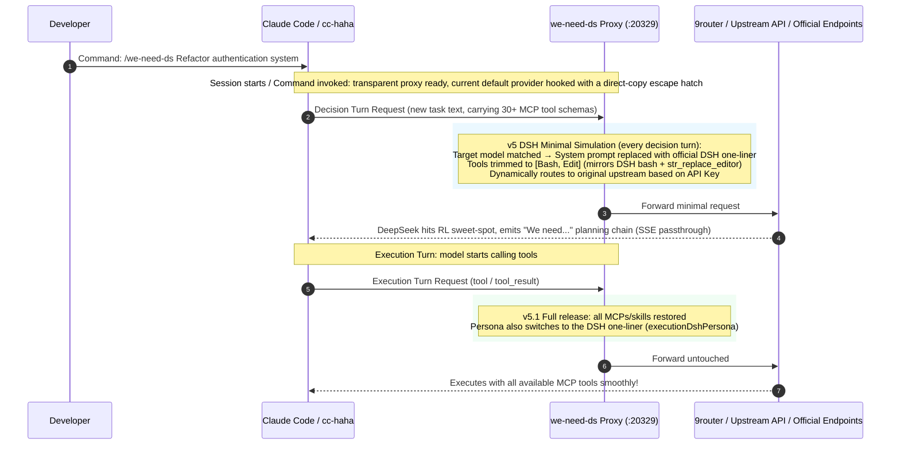

# we-need-ds 🎯

> **The first native Claude Code & [cc-haha](https://github.com/NanmiCoder/cc-haha) plugin for unlocking full-power "We need" reasoning chains in DeepSeek Pro models.**

<p align="center">
  
  
  
  
  
</p>

[简体中文文档](README.md) | English Documentation

---

## 🧐 Background: The "We need" vs "Let me" Dilemma

Recent community research (pioneered by the DeepSeek Harness community) revealed a critical duality in **DeepSeek-V4-Pro series models** under different tool schemas:

| Mode | Characteristics | Root Cause |
| :--- | :--- | :--- |
| 🟢 **"We need..." Full-Power Deep Planning** | Deconstructs problems globally, plans architecture, handles edge cases, and demonstrates top-tier AGI-level strategic reasoning. | Model only sees a minimal essential toolset in turn 1, entering its RL **deep reasoning sweet-spot**. |
| 🔴 **"Let me..." Shallow Tool-Churning** | Gets bogged down in micro-level tool trials, excessive looping, and shallow heuristics. | Client injects dozens of MCP tools, skill schemas, and verbose docs in turn 1, over-directing attention. |

### The Problem in Claude Code Ecosystem
* **Claude Code developers rely heavily on MCPs** (databases, browsers, terminals, file editors). Disabling them manually destroys the workflow, but leaving them enabled traps DeepSeek in the "Let me" trap.
* **Prompt hypnosis fails**: System prompts cannot overcome the raw attention weight of dozens of JSON tool schemas in the request body.

---

## 💡 The Solution: Turn-Aware DSH Minimal Simulation (v5)

**`we-need-ds`** provides a transparent, zero-latency proxy plugin that dynamically decouples tool exposure based on request structure:



---

## ✨ Key Features

1. **⚡ Single-Provider Hook & Direct-Copy Escape**:
   * Hooks **only the provider that is actually in use** — the current default (`activeId`) in `providers.json` that genuinely offers DeepSeek Pro models. Every other provider keeps its real upstream `baseUrl` untouched.
   * At hook time it also clones a temporary `· direct copy` provider whose `baseUrl` points at the **original real upstream** — that's your escape hatch: if the daemon ever dies and the body points at a dead port, switch to the copy in cc-haha and you're connected directly again, then run `off`/`boot`/`on` at leisure.
   * The copy doubles as a **redundant ledger**: even if `runtime-state.json` is lost or corrupted, the body's real upstream can be recovered from the copy's `baseUrl`.
   * Incoming requests are routed back to their real upstream dynamically by API Key / Token, so switching models across windows and tabs causes zero interference.
2. **🎯 Turn-Aware DSH Minimal Simulation (v5.1, unified persona on all turns)**:
   * Pure request-structure detection: last message is fresh user text = **decision turn** (model plans), last message is tool/tool_result = **execution turn** (tool follow-up);
   * **Every decision turn** (not just the first) simulates the official DeepSeek Harness minimal mode: system prompt replaced with the official DSH one-liner `You are a helpful software engineer assistant.`, tools trimmed to the `Bash + Edit` pair (mirroring DSH's bash + str_replace_editor);
   * **Every execution turn (v5.1)** keeps full unrestricted tools while the persona is also switched to the DSH one-liner — the client only hard-validates JSON protocol structure (tool_use/tool_result blocks), never persona text, so the swap is protocol-safe; after an execution chain ends, the next new task re-enters minimal mode automatically. Set `executionDshPersona: false` to fall back to v5 behavior (execution turns fully untouched). Zero configuration.
3. **🛡️ Triple Safety Lifecycle & Zero-Deadlock Guarantee**:
   * **Host hook auto-takeover**: SessionStart hook self-starts the proxy; UserPromptSubmit hook self-checks and revives it on every new message; SessionEnd hook batch-restores at session end (effective on hosts that support plugin hooks).
   * **Manual recovery after reboot (host-hook independent, no system-level registration)**: Windows shutdown/restart kills the daemon outright and bypasses every hook, leaving the hooked body pointing at a dead proxy port in an "orphan" state. But **all other providers and the direct copy always stay connected directly**, so you can still send messages and run recovery commands — no more "everything points at a dead port, can't even send `on`" deadlock. Recovery: switch to the direct copy (or any non-hooked provider) in cc-haha, then run `/we-need-ds:on` (or `node lib/ctl.js boot` in a terminal) — revive daemon + fix orphans + re-hook from the ledger. The plugin registers no scheduled tasks and writes nothing to the Startup folder; uninstalling leaves nothing behind (see "Manual Recovery After Reboot" below).
   * **Always-on daemon**: stays resident by default (`idleAutoShutdownMinutes: 0`).
   * **100% Zero-Touch for Non-Target Models**: Claude, GPT, Gemini, Qwen models pass through with pure byte-level streaming.

---

## 🚀 Getting Started

### 🅰️ Using with [cc-haha](https://github.com/NanmiCoder/cc-haha)

1. **Set the provider you're actually using as the default first**:
   * cc-haha's sidecar strips the path prefix when forwarding, so the proxy can only identify the source by API Key and cannot tell from the request "which provider you just switched to". The plugin therefore uses `activeId` (the default provider) as the takeover marker. **Before enabling, set the DeepSeek Pro provider you're really using as the default in cc-haha**, and the plugin will hook it.
   * **Takeover depends only on the `models` field the provider declares**: the plugin reads this provider's `models` map (main/haiku/sonnet/opus, etc.) from `providers.json`, and hooks it only if any declared model name matches the DeepSeek Pro check (in `targetModels`, or normalized to contain `deepseek|ds` plus `v4|pro|flash`). A relay like 9Router, even if it **can actually forward** DeepSeek models, is treated as "non-DS provider" and **not hooked** (kept direct, no trimming) as long as its `models` field doesn't declare a deepseek model name. So make sure the provider you set as default actually declares a DeepSeek Pro model in its `models` — in normal use you switch to a DeepSeek model first anyway, so this is naturally satisfied.
   * Every other provider's `baseUrl` stays untouched, pointing at its own real upstream — this is exactly the deadlock-prevention key: if the daemon ever dies, you still have plenty of direct entry points plus the auto-generated direct copy to switch to.
2. **Enable = hook the default + create the copy**:
   * Run `/we-need-ds:on` (or `node lib/ctl.js on` in a terminal): revives the daemon, switches the default DS provider's `baseUrl` to the proxy port, and clones a `· direct copy` (pointing at the original real upstream) as the escape hatch.
   * Switch the default provider and run `on` again: the old body is auto-restored to direct, the new default gets hooked, and only one copy is ever kept.
3. **Run `off` before quitting (recommended habit)**:
   * Before closing cc-haha / shutting down, run `/we-need-ds:off` to restore the body to direct and remove the copy — clean ledger. Even if you forget, after a reboot you can still send messages via the copy or any non-hooked provider and run `boot`/`on` to recover; nothing gets stuck.
4. **Daily usage**:
   * Type directly in the chat box:
     ```bash
     /we-need-ds Refactor the user auth module and write test cases
     ```
   * When you want deep reasoning first without writing code:
     ```bash
     /we-need-ds:plan Plan a large-scale system refactoring
     ```

---

### 🅱️ Using with Official Vanilla Claude Code

1. Set your upstream and proxy environment variables:
   ```bash
   export ANTHROPIC_UPSTREAM_BASE_URL="http://127.0.0.1:20128"
   export ANTHROPIC_BASE_URL="http://127.0.0.1:20329"
   ```
2. Start `claude` normally. Every decision turn for `deepseek-v4-pro*` enters the DSH minimal environment triggering "We need" reasoning, tool execution turns get full tool access, and all other models (Claude 3.7, GPT, Gemini) pass through 100% untouched.

---

## 🎮 Command Matrix

| Skill Command | Description | Typical Use Case |
| :--- | :--- | :--- |
| **`/we-need-ds <task>`** | **Execute with full-power reasoning** | Primary entry point: enables interception and runs task |
| **`/we-need-ds:plan <task>`** | **Read-only planning agent** | Summons `we-need-planner` to generate Markdown blueprint |
| **`/we-need-ds:doctor`** | **Health diagnostic** | Inspects proxy port, environment mode, provider pool takeover and connectivity status |
| **`/we-need-ds:test`** | **Run test simulation suite** | Assertions covering decision-turn minimal mode, execution-turn passthrough, non-target passthrough, M1/M3 edge cases, and the non-DS safety baseline |
| **`/we-need-ds:status`** | **Inspect runtime status** | Shows daemon state, interception switch, hooked providers, and logs |
| **`/we-need-ds:on`** | **Enable interception** | Hooks the current default DS provider and creates the direct copy; decision turns enter minimal simulation by default |
| **`/we-need-ds:off`** | **Force disable & restore** | Restores the hooked body to its real upstream and removes the direct copy |
| **`/we-need-ds:restart`** | **Gracefully restart the daemon** | When the proxy is wedged (e.g. full of stalled upstream requests) or after a code update: kills the old process → spawns a fresh daemon → re-hooks providers from the ledger |

---

## 🔌 Manual Recovery After Reboot (no system-level registration)

Windows shutdown/restart **kills the daemon outright** and bypasses every session hook — the hooked body is left in an "orphan" state pointing at a dead proxy port. This plugin **deliberately performs no system-level persistence** (no scheduled tasks, no Startup-folder entries): a plugin should be a plugin — it doesn't silently modify your system, and uninstalling leaves nothing behind.

**Since v2.2.0 the deadlock is eradicated**: the proxy hooks only the single current default provider, while all other providers and the auto-generated `· direct copy` always stay connected directly. So even after a reboot with the daemon dead, you can still send messages normally (via any non-hooked provider or the copy) and recovery commands still get through — no more "everything points at a dead port, can't even send `on`" deadlock.

Therefore **after a reboot, or after fully restarting cc-haha / Claude Code**, start interception once explicitly (same as invoking any skill):

- Run `/we-need-ds:on` in Claude Code — revives the daemon + restores orphans + re-hooks from the ledger, in one step;
- Or run `node "<CACHE>\lib\ctl.js" boot` in a terminal — the host-hook-independent equivalent, self-healing per the ledger's `enabled` flag (enabled → revive daemon + restore orphans + re-hook; disabled → clean up strays).

In-session self-healing (the UserPromptSubmit hook: every new message checks the daemon and revives + re-hooks if it's dead) still works on hosts that support plugin hooks (e.g. native Claude Code), and doesn't conflict with the manual start above. cc-haha's sidecar runs as a persistent server and does not execute plugin hooks, so under cc-haha rely on the manual `on`/`boot`.

**Fail-safe restore (no deadlock)**: every recovery path (`on` / `boot` / hooks) that fails to bring the daemon up **automatically restores any provider still pointing at the proxy port back to its real upstream** — never leaving a deadlocked state where endpoints point at a dead proxy, the app is unusable, and even the recovery command can't get through. The restore is **not one-way**: on the very next message, if the ledger says `enabled`, the daemon is alive, and zero providers are hooked, the UserPromptSubmit hook re-hooks automatically — so the first turn after recovery is proxied and trimmed again. `status` / `doctor` print a prominent warning (plus the recovery command) when providers point at the proxy port but the daemon is down.

---

## ⚙️ Configuration (`config.json`)

```json
{
  "port": 20329,
  "targetBaseUrl": "auto",
  "targetModels": [
    "deepseek-v4-pro-0813",
    "deepseek-v4-pro",
    "deepseek-v4-flash",
    "deepseek-v4-flash-0731"
  ],
  "bootstrapCoreTools": [
    "Bash",
    "Edit"
  ],
  "logDetails": false,
  "idleAutoShutdownMinutes": 0,
  "executionDshPersona": true,
  "thinkingBudget": 0,
  "upstreamRetries": 2,
  "upstreamRetryBackoffMs": 500,
  "upstreamHeaderTimeoutMs": 30000,
  "upstreamBodyTimeoutMs": 30000,
  "upstreamIdleTimeoutMs": 600000
}
```

| Option | Default | Description |
| :--- | :--- | :--- |
| `port` | `20329` | Local transparent proxy port (binds 127.0.0.1 only). Change if occupied; the `WE_NEED_DS_TEST_PORT` env var overrides it for tests without touching production config. |
| `targetBaseUrl` | `"auto"` | Upstream resolution. `"auto"` = route each request back to its provider's real upstream by API Key from the ledger; a concrete URL forces all traffic to that upstream. |
| `targetModels` | DS V4 family | Models that trigger interception (normalization engine matches underscores/spaces/hyphens/path prefixes/case variants). **Every model outside this list (Claude / GPT / Gemini / Qwen, …) is passed through byte-for-byte, never modified.** |
| `bootstrapCoreTools` | `["Bash","Edit"]` | Minimal tool set kept on decision turns (mirrors DSH's bash + str_replace_editor pair). Tools already invoked in conversation history are also auto-kept to avoid protocol validation errors. |
| `logDetails` | `false` | When `true`, logs every passthrough request's URL and upstream (for routing debugging). |
| `idleAutoShutdownMinutes` | `0` | Idle auto-release switch. Default `0` = daemon stays resident; set to N to auto-restore the hooked provider(s) to direct and exit after N idle minutes — the UserPromptSubmit hook revives it on your next message. |
| `executionDshPersona` | `true` | Whether execution turns also switch to the DSH persona (default `true`; `false` restores v5 full passthrough on execution turns). |
| `thinkingBudget` | `0` | Optional Anthropic extended-thinking budget on decision turns. Default `0` = off (no thinking field injected; relies on the model's native chain). A positive N injects `thinking: {type:"enabled", budget_tokens:N}` as an optional reinforcement for deep reasoning. |
| `stripSystemPersona` | *(absent = on)* | Master persona-replacement switch. By default every DS-target request gets the DSH one-liner persona; set to `false` to disable persona replacement entirely (tool trimming still applies). |
| `upstreamRetries` | `2` | Upstream retry count (excluding the first attempt, so 3 total tries by default). Retries on empty body, connection reset, 5xx, or timeout (see the three gates below). **Only retried before any byte reaches the client** — once a streaming response has started forwarding it is never retried (avoids duplicated content). Set `0` to disable. |
| `upstreamRetryBackoffMs` | `500` | Retry backoff base in ms, doubling per attempt (500→1000→…); takes the larger of this and the upstream `Retry-After` header when present. |
| `upstreamHeaderTimeoutMs` | `30000` | **Header timeout** in ms. If the upstream doesn't even return response headers within this window after the request is sent (connection-level stall), it is treated as a retryable failure and fails fast instead of hanging until the socket timeout. |
| `upstreamBodyTimeoutMs` | `30000` | **Non-streaming body timeout** in ms. Applies only to non-streaming responses (`Content-Type` is not `text/event-stream`): headers arrived but not a single body byte within this window ("headers but no body" stall) is treated as a retryable failure. **Streaming responses are exempt from this gate** — reasoning models (e.g. deepseek-v4-pro) can legitimately take tens of seconds or more before the first token; once headers arrive the proxy waits indefinitely for the first byte and never kills a slow-thinking stream. |
| `upstreamIdleTimeoutMs` | `600000` | **Socket idle timeout** in ms. An upstream connection with no activity for this long is considered dead and destroyed (default 10 minutes, covering long silent thinking stretches in a stream). |

---

## ⚠️ Boundaries & Notes

1. **Ledger trust chain**: when the plugin rewrites a provider's `baseUrl` to the proxy address, it records the baseUrl *at the moment of rewriting* as the real upstream (`originalUrl`). So **make sure every provider's baseUrl in cc-haha points to a real upstream** (official endpoint or your own relay, e.g. 9router on `:20128`). If you manually configure a provider to point at *another proxy*, the plugin will record that proxy address as the real upstream and restore to it — this is a design boundary, not a bug. Run `/we-need-ds:doctor` before enabling interception to verify each provider's original upstream.
2. **Two version lines**: **v5 / v5.1** throughout the docs refers to the **mechanism version** (the turn-aware DSH minimal simulation algorithm's evolution codename); the plugin itself follows **semver** (see `plugin.json` and CHANGELOG, currently `2.2.x`). They are numbered independently: mechanism v5.1 ships in the plugin 2.x series. GitHub Releases use semver.
3. **Port occupancy**: the proxy binds `127.0.0.1:20329` by default. If occupied, change `port` in `config.json`; on a port change the plugin first restores providers pointing at the old port, then re-hooks them on the new port — the proxy address is never recorded as a real upstream.
4. **Test isolation (read before running the suites)**: the self-test suites rewrite providers.json and runtime-state.json. To avoid polluting your live environment, set three isolation env vars so tests read/write a temp dir and never touch production files: `WE_NEED_DS_TEST_PORT` (test port), `WE_NEED_DS_PROVIDERS_PATH` (temp providers.json path), `WE_NEED_DS_DATA_DIR` (temp data dir). `test_full.js` / `test_consume.js` have this isolation built in (via `os.tmpdir()`), so `node test_full.js` is safe as-is; when manually running takeover commands like `ctl on/off` without touching production, set the same three vars.

---

## 📄 License

MIT License. Authored by [YixuAn](https://github.com/YixuAnsensei).  
Special thanks to [cc-haha](https://github.com/NanmiCoder/cc-haha) and the DeepSeek Harness community.
